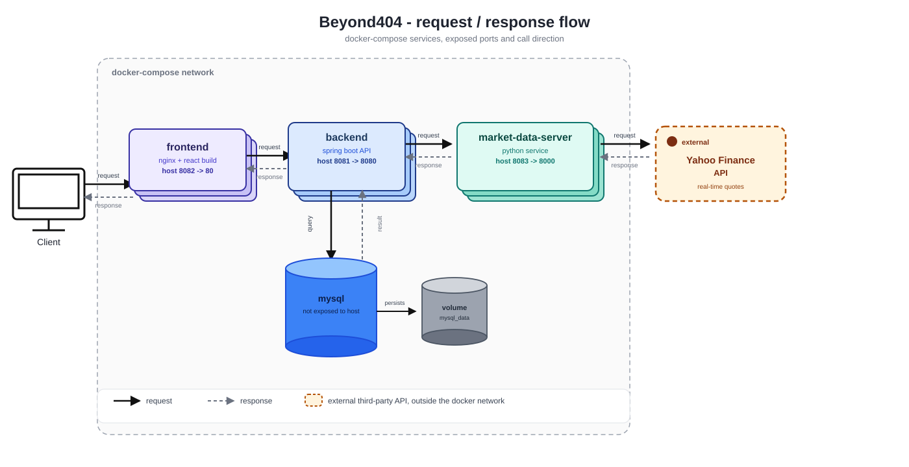

# Beyond404 Portfolio Management

Beyond404 Portfolio Management is a full-stack portfolio analysis platform for tracking holdings, reviewing transaction history, exploring market data, and running paper-trading analysis workflows from a single interface. The system combines a React frontend, a Spring Boot application, a FastAPI market-data microservice, and a MySQL database into a modular architecture that supports portfolio visibility, stock discovery, and algorithm-assisted decision support.

The current implementation is centered on advisor or analyst-style portfolio review rather than retail account onboarding. Users select an existing customer profile, inspect holdings and performance, search external market symbols, place simulated buy or sell orders, and run algorithmic analysis checkpoints against a curated list of tickers.

## Architecture

The diagram below shows the technical architecture of the Beyond404 Portfolio Management system, including how the React frontend, Spring Boot backend, FastAPI market-data microservice, Nginx reverse proxy, and MySQL database interact.



## Summary


This website is designed as a portfolio management workspace where a user can:

- review a customer portfolio from a dashboard view
- inspect stock-wise allocation, profit and loss, and historical trends
- search live market symbols through an external market-data service
- simulate buy and sell transactions in paper-trading mode
- evaluate rule-based trading signals before executing a trade
- analyze portfolio composition using charts, tables, and derived metrics

The frontend exposes the product as a multi-page application with dashboard, portfolio, analysis, profile, user-management, community, and help sections. The most complete product flows are currently concentrated in the dashboard, portfolio, and analysis pages.

## User Story

As a portfolio manager or investment analyst, I want to review customer holdings, compare them against live market information, and test trading decisions in a safe paper-trading environment so that I can make more informed portfolio decisions without affecting real capital.

## Use Cases

- A user selects a customer and opens the dashboard to review total holdings, asset distribution, portfolio charts, and a holdings overview table.
- A user opens the portfolio page to inspect stock-level performance, recent transactions, and detailed quote information for a selected holding.
- A user searches for a market symbol that is not currently owned, loads its market details, and evaluates whether it should be added to the portfolio.
- A user places a simulated buy or sell order to test how a transaction would update the customer portfolio.
- A user runs algorithm analysis on selected checkpoint tickers and reviews generated trade signals before executing a paper trade.
- A user retrieves historical and recent market data through the market-data microservice to support charting and portfolio calculations.

## Architecture

The repository is organized as a distributed application with four runtime components.

| Component | Stack | Responsibility | Default Port |
| --- | --- | --- | --- |
| Frontend | React 19, Vite, Redux Toolkit, Tailwind CSS | Portfolio UI, routing, visual analytics, user workflows | 5144 in local dev, 8082 in Docker |
| Backend | Spring Boot, JDBC, MySQL | Portfolio APIs, customer and investment workflows, analytics aggregation, paper-trading endpoints | 8080 in local dev, 8081 in Docker |
| Market Data Server | FastAPI, Pydantic, yfinance | Quote lookup, symbol search, recent candles, historical market data | 8000 in local dev, 8083 in Docker |
| Database | MySQL 8 | Customers, stocks, investments, and holdings persistence | 3306 |

## Repository Structure

```text
.
├── docker-compose.yml
├── backend/
│   └── app/
│       ├── src/main/java/...         # Spring Boot controllers, services, repositories, models
│       ├── src/main/resources/       # application.properties, schema.sql, data.sql
│       └── pom.xml
├── frontend/
│   └── portfolio/
│       ├── src/components/           # dashboard, layout, and portfolio UI components
│       ├── src/pages/                # routed application pages
│       ├── src/api/                  # API clients for backend and market endpoints
│       └── package.json
├── market-data-server/
│   ├── app/                          # FastAPI app, routers, services, validation, models
│   ├── tests/                        # pytest coverage for health, validation, and endpoints
│   └── pyproject.toml
└── database/                         # standalone SQL seed or reference scripts
```

## Core Functional Areas

### Dashboard

- portfolio summary cards
- total holdings snapshot
- portfolio charting and allocation visualization
- holdings treemap and pie chart
- tabular portfolio overview

### Portfolio Operations

- stock-wise profit and loss analysis
- per-stock transaction history
- market symbol search and quote lookup
- paper buy and sell workflows

### Analysis

- checkpoint ticker selection
- strategy execution through the algorithm endpoint
- review of generated trading signals
- optional paper-trade execution based on signal output

### Market Data Integration

- symbol autocomplete and search
- latest quote retrieval
- recent candle retrieval
- custom historical range retrieval

## How to Run

You can run the system either through Docker Compose or by starting each service locally.

### Prerequisites

- Docker and Docker Compose, if you want the simplest full-stack startup
- Java 17 and Maven wrapper support for the Spring Boot backend
- Node.js 22 or a compatible modern Node.js version for the frontend
- Python 3.11 or newer for the market-data server
- MySQL 8 if you run the services manually instead of through Docker

### Option 1: Run the Full Stack with Docker Compose

From the repository root:

```bash
docker compose up --build
```

This starts:

- frontend at http://localhost:8082
- backend at http://localhost:8081
- market-data server at http://localhost:8083
- MySQL at localhost:3306

The compose file wires the backend to MySQL and to the market-data server automatically.

To stop the stack:

```bash
docker compose down
```

To also remove the database volume:

```bash
docker compose down -v
```

### Option 2: Run Services Locally for Development

#### 1. Start MySQL

Create a local MySQL database named `beyond404` and configure credentials to match the backend defaults, or override them with environment variables.

Default backend datasource settings:

- `DB_URL=jdbc:mysql://localhost:3306/beyond404`
- `DB_USERNAME=root`
- `DB_PASSWORD=n3u3da!`

The backend is configured to initialize `schema.sql` and `data.sql` automatically on startup.

#### 2. Start the Market Data Server

```bash
cd market-data-server
pip install -r requirements.txt
python -m app.main
```

The service will be available at http://localhost:8000.

Alternative command:

```bash
uvicorn app.main:app --host 0.0.0.0 --port 8000 --reload
```

#### 3. Start the Spring Boot Backend

```bash
cd backend/app
./mvnw spring-boot:run
```

On Windows PowerShell:

```powershell
cd backend/app
.\mvnw.cmd spring-boot:run
```

The backend runs on http://localhost:8080 by default.

Useful environment variables:

- `DB_URL`
- `DB_USERNAME`
- `DB_PASSWORD`
- `MARKET_DATA_BASE_URL=http://localhost:8000`
- `APP_CORS_ALLOWED_ORIGIN_PATTERNS=*`

#### 4. Start the Frontend

```bash
cd frontend/portfolio
npm install
npm run dev
```

The Vite development server runs on http://localhost:5144.

By default, the frontend proxies `/api` and `/beyond404` requests to http://localhost:8080 during local development.

If you want the frontend to call a different backend origin directly, define `VITE_API_BASE_URL` before starting Vite.

## API Surface Overview

The backend and market-data service expose separate endpoint families.

### Spring Boot Backend

Examples of backend capabilities include:

- `/api/customers` for customer lookup and creation
- `/api/investments` for investment records and paper-trading operations
- `/api/asset-holdings` for holdings data
- `/api/portfolio-analytics` for stock-wise analytics
- `/api/performance` for performance views
- `/api/market` for backend market-related endpoints
- `/api/algo` for algorithm execution
- `/beyond404/Portfolio/analysis` for portfolio analysis aggregates
- `/beyond404/stocks` for stock reference data

### FastAPI Market Data Server

- `/api/v1/health`
- `/api/v1/market/search`
- `/api/v1/market/quote`
- `/api/v1/market/recent`
- `/api/v1/market/history`

## Testing

### Backend

```bash
cd backend/app
./mvnw test
```

On Windows PowerShell:

```powershell
cd backend/app
.\mvnw.cmd test
```

### Frontend

```bash
cd frontend/portfolio
npm run lint
```

### Market Data Server

```bash
cd market-data-server
pytest -v
```

## Notes

- The backend is configured for paper-trading mode by default through `algo.paper-trading=true`.
- The customer-selection flow is central to the current user experience. Several primary pages expect an existing customer to be selected before portfolio data can load.
- Some routed frontend sections exist as product placeholders or secondary pages, while the main implemented investment workflows are concentrated in the dashboard, portfolio, and analysis experiences.

## Recommended Next Steps

- add screenshots or architecture diagrams for onboarding contributors
- document seed data and example customer scenarios in more detail
- add a dedicated environment configuration section with `.env` examples for each service